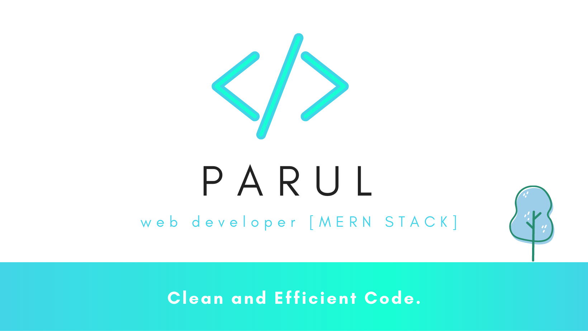

<!---->

<!--
**ParulSharma4501/ParulSharma4501** is a ✨ _special_ ✨ repository because its `README.md` (this file) appears on your GitHub profile.

Here are some ideas to get you started:

- 🔭 I’m currently working on ...
- 🌱 I’m currently learning ...
- 👯 I’m looking to collaborate on ...
- 🤔 I’m looking for help with ...
- 💬 Ask me about ...
- 📫 How to reach me: ...
- 😄 Pronouns: ...
- ⚡ Fun fact: ...
-->
  

<h2>👋 Hi, I'm <b>Parul Sharma</b></h2>

I am a <b>Data Engineer</b> passionate about building scalable data solutions, optimizing pipelines, and enabling data-driven decision-making.  
With a strong foundation in <b>Python, SQL, Cloud Platforms</b> and a background in full-stack development (MERN Stack), I bridge the gap between data engineering and application development.

<h3>💻 Technical Skills</h3>

<b>Programming & Scripting:</b> Python, JavaScript, SQL

<b>Data Engineering:</b> ETL/ELT, Data Warehousing, BigQuery, Apache Airflow

<b>Databases:</b> PostgreSQL, MySQL, MongoDB

<b>Cloud & Tools:</b> Google Cloud Platform (GCP), AWS, Docker, Git

<b>Web Development (Past Experience):</b> React.js, Node.js, Express.js, HTML, CSS, Bootstrap

<h3>📂 Featured Projects</h3>

<b>1. Data Pipeline Automation – [Confidential Project]</b>  
Designed and implemented automated ETL pipelines for large-scale data ingestion, transformation, and loading into a cloud warehouse.  
<b>Tech Stack:</b> Python, Airflow, GCP, BigQuery, SQL  

 

<b>2. HEALTH TRACKER Website – SoftSpot</b>  
A full-fledged medical health tracker for patients.  
<b>Frontend:</b> HTML, CSS, Bootstrap, JavaScript, jQuery  
<b>Backend:</b> PHP, AngularJS, AJAX  
<b>Database:</b> MySQL  
<a href="https://softspot.000webhostapp.com/" target="_blank">🔗 View Project</a>  

<h3>📫 Connect with Me</h3>

